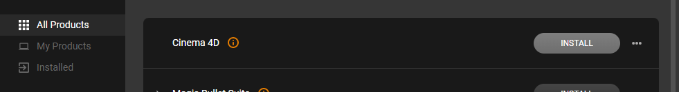
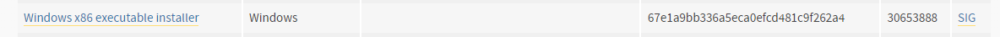
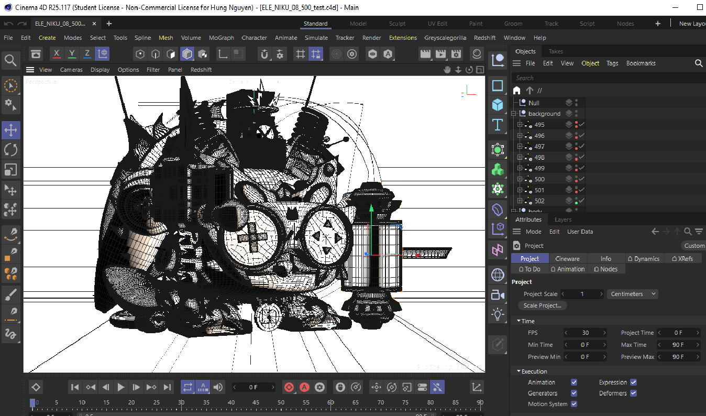

# AUTOMATIC NEKO BREEDING
> For the teams in the Neko Global to be able to generate Neko images with C4D software automatically

## Prerequisites

You'll need [CINEMA 4D R25](https://www.maxon.net/en/downloads/cinema-4d-r25-downloads) and [python3.6.4](https://www.python.org/downloads/release/python-364/).

### 1. CINEMA 4D R25 Installation

First of all, you need to access [Maxon](https://www.maxon.net/en/downloads) page and download the Maxon installer for Windows by clicking `DOWNLOAD MAXON APP 2.1.2` like the screenshot below:


Execute the downloaded file to install `Maxon` app on your Windows 10 local machine

Next, you should open the `Maxon` app and install `CINEMA 4D R25` software in the `All Products` list like the screenshot below:



Finally, you need to install `Greyscalegorilla`

### 2. Install SendPythonCodeToCinema4D plugin
- Open the `CINEMA 4D R25` software
- Choose `File->Preferences` and click `Open Preferences Folder`
- When a window appears, go to `plugins` folder
- Copy `SendPythonCode` in this directory to `plugins` folder

### 3. Python 3.6.4 Installation
Access [python3.6.4](https://www.python.org/downloads/release/python-364/) homepage and scroll down to the end of the page. Download the `Windows x86 executable installer` like the screenshot below:



Execute the downloaded file to install Python on your Windows 10 operating system.

## Project Structure

```
    .
    ├── assets/
    ├── c4d/
    ├── csv/
    ├── save/
    ├── SendPythonCode/
    │   ├── send_python_code.html
    │   ├── SendPythonCodeToCinema4D.pyp
    ├── .gitignore
    ├── constants.py
    ├── README.md
    ├── render-follow-api.py
    ├── render-follow-csv.py
    ├── run.sh
    ├── upload.py
```

- C4d files are saved in the `c4d` folder, you need to open one of them before running the program

- Csv files which contains data are saved in the `csv` folder (Only help you to visualize the data, not support for the program execution)

- Generated images are saved in the `save` folder you create. 
## Getting Started

After cloning this project, go to the work directory and run the program:

First of all, you need to open your c4d file you want with `CINEMA 4D R25` software. 

You should see something like this:



Create a folder to save images on your local machine ( unnecessary if `save` folder existed )
```bash
mkdir save
```
Run the program
```bash
bash run.sh
```
